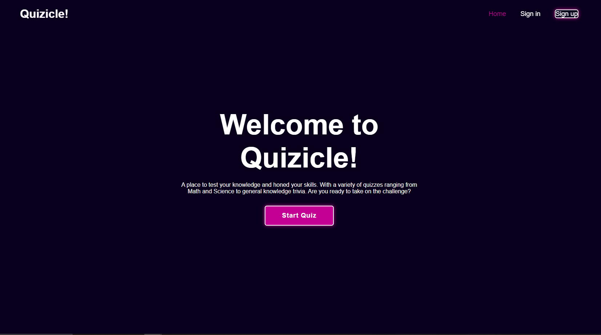

Azka Dwi Putra Azhad 2702357926

# Human and Computer Interaction Final Project

## Table of Contents
1. [Introduction](#introduction)
2. [Documentation](#documentation)
3. [The Application](#application)

## Introduction
Quizicle is a simple quiz website for learning and testing your knowledge. It is inspired by similar websites such as Kahoot and Quiziz. They allow you to answer questions using multiple-choice answers and have visual feedback when getting the correct or wrong answers.

## Documentation
This project has been documented in a report made using PowerPoint slides showing how the process and progress of creating the application as well as the presentation slides:

- [Slides Link] : https://www.canva.com/design/DAGL7FTvBsY/NOZy6fAEJj3mmVc3VLqsdQ/edit?utm_content=DAGL7FTvBsY&utm_campaign=designshare&utm_medium=link2&utm_source=sharebutton

## Application 

